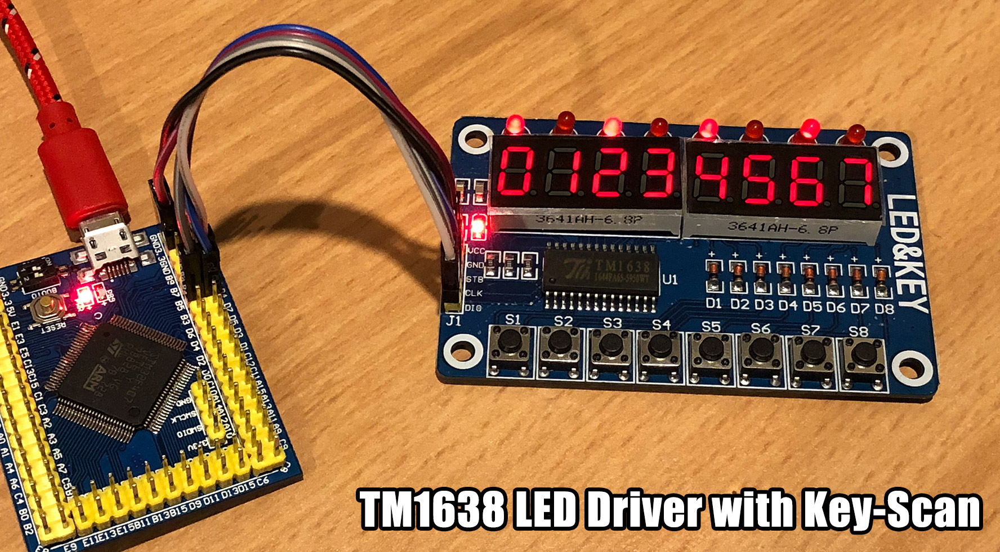

# MicroPython TM1638 LED Driver

A MicroPython library for LED&KEY modules with 8x 7-segment decimal LED modules, 8x individual LEDs and 8x switches using the TM1738 LED driver.



## Examples

Copy the file to your device, using [ampy](https://github.com/adafruit/ampy), [rshell](https://github.com/dhylands/rshell), [webrepl](http://micropython.org/webrepl/) or compiling and deploying. eg.

```
$ ampy put tm1638.py
```

**Basic usage**

```
# Wemos D1 Mini / ESP8266
import tm1638
from machine import Pin
tm = tm1638.TM1638(stb=Pin(13), clk=Pin(14), dio=Pin(12))

# STM32F407VET6
import tm1638
from machine import Pin
tm = tm1638.TM1638(stb=Pin('B4'), clk=Pin('B5'), dio=Pin('B6'))

# every 2nd LED on
tm.leds(0b01010101)

# all LEDs off
tm.leds(0)

# segments
tm.show('cool')
tm.show('abcdefgh')
tm.number(-1234567)
tm.number(1234)
tm.number(5678, 4)
tm.hex(0xdeadbeef)

# dim both LEDs and segments
tm.brightness(0)

# all LEDs and segments off
tm.clear()

# get which buttons are pressed
tm.keys()
```

For more detailed examples, see [examples](/examples).

# Seven Segment Font

They are called 7-segment displays as there are 7 LEDs for each digit (segment).
One byte (7 lower bits) for each segment. The 8th bit (MSB) is for the decimal point on each segment.

```
      A
     ---
  F |   | B
     -G-
  E |   | C
     ---  * H
      D

  HGFEDCBA
0b01101101 = 0x6D = 109 = show "5"
```

Display | Bin        | Hex  | Dec
------- | ---------- | ---- | ---
0       | 0b00111111 | 0x3F | 63
1       | 0b00000110 | 0x06 | 6
2       | 0b01011011 | 0x5B | 91
3       | 0b01001111 | 0x4F | 79
4       | 0b01100110 | 0x66 | 102
5       | 0b01101101 | 0x6D | 109
6       | 0b01111101 | 0x7D | 125
7       | 0b00000111 | 0x07 | 7
8       | 0b01111111 | 0x7F | 127
9       | 0b01101111 | 0x6F | 111
A       | 0b01110111 | 0x77 | 119
b       | 0b01111100 | 0x7C | 124
C       | 0b00111001 | 0x39 | 57
d       | 0b01011110 | 0x5E | 94
E       | 0b01111001 | 0x79 | 121
F       | 0b01110001 | 0x71 | 113
G       | 0b00111101 | 0x3D | 61
H       | 0b01110110 | 0x76 | 118
I       | 0b00000110 | 0x06 | 6
J       | 0b00011110 | 0x1E | 30
K       | 0b01110110 | 0x76 | 118
L       | 0b00111000 | 0x38 | 56
M       | 0b01010101 | 0x55 | 85
n       | 0b01010100 | 0x54 | 84
O       | 0b00111111 | 0x3F | 63
P       | 0b01110011 | 0x73 | 115
q       | 0b01100111 | 0x67 | 103
r       | 0b01010000 | 0x50 | 80
S       | 0b01101101 | 0x6D | 109
t       | 0b01111000 | 0x78 | 120
U       | 0b00111110 | 0x3E | 62
v       | 0b00011100 | 0x1C | 28
W       | 0b00101010 | 0x2A | 42
X       | 0b01110110 | 0x76 | 118
y       | 0b01101110 | 0x6E | 110
Z       | 0b01011011 | 0x5B | 91
blank   | 0b00000000 | 0x00 | 0
\-      | 0b01000000 | 0x40 | 64
\*      | 0b01100011 | 0x63 | 99

# Methods

Power up, power down or check status.
```
power(val=None)
```

Get or set brightness.
```
brightness(val=None)
```

Write zeros to each address.
```
clear()
```

Write to all 16 addresses from a given position.
Order is left to right, 1st segment, 1st LED, 2nd segment, 2nd LED etc.
```
write(data, pos=0)
```

Set the value of a single LED.
```
led(pos, val)
```

Set all LEDs at once. LSB is left most LED.
Only writes to the LED positions (every 2nd starting from 1).
```
leds(val)
```

Set one or more segments at a relative position.
Only writes to the segment positions (every 2nd starting from 0).
```
segments(segments, pos=0)
```

Return a byte representing which keys are pressed. LSB is SW1.
```
keys()
```

Convert a single hex digit (0x00-0x0f) to a segment.
```
encode_digit(digit)
```

Convert a string to a list of segments. Dots are merged with the previous character.
```
encode_string(string)
```

Convert a single character to a segment.
```
encode_char(char)
```

Display a number in hexadecimal format 00000000 through FFFFFFFF, right aligned, leading zeros.
```
hex(val)
```

Display a numeric value -9999999 through 99999999, right aligned.
```
number(num)
```

Display a temperature -9 through 99 followed by degrees C.
```
temperature(num, pos=0)
```

Displays a relative humidity -9 through 99 followed by RH.
```
humidity(num, pos=4)
```

Displays as much of a string as will fit.
```
show(string, pos=0)
```

Display a string, scrolling from the right to left, speed adjustable.
String starts off-screen right and scrolls until off-screen left at 4 FPS by default.
```
scroll(string, delay=250)
```

## Parts

* [WeMos D1 Mini](https://www.aliexpress.com/store/product/D1-mini-Mini-NodeMcu-4M-bytes-Lua-WIFI-Internet-of-Things-development-board-based-ESP8266/1331105_32529101036.html) $6.36 AUD
* [LED&KEY TM1638 Module](https://www.aliexpress.com/item/TM1638-Module-Key-Display-For-AVR-Arduino-New-8-Bit-Digital-LED-Tube-8-Bit-TM1638/32805933184.html) $2.30 AUD
* [Female-Female Dupont wires](https://www.aliexpress.com/item/10pcs-10cm-2-54mm-1p-1p-Pin-Male-to-Male-Color-Breadboard-Cable-Jump-Wire-Jumper/32636873838.html) $0.62 AUD

## Connections

WeMos D1 Mini | LED&KEY TM1638 Module
------------- | -----------------
3V3 (or 5V)   | VCC
G             | GND
D7 (GPIO13)   | STB
D5 (GPIO14)   | CLK
D6 (GPIO12)   | DIO

STM32F407VET6 | LED&KEY TM1638 Module
------------- | -----------------
3V3           | VCC
G             | GND
B4            | STB
B5            | CLK
B6            | DIO

## Links

* [WeMos D1 Mini](https://wiki.wemos.cc/products:d1:d1_mini)
* [micropython.org](http://micropython.org)
* [TM1638 datasheet](http://titanmec.com/index.php/en/project/download/id/303.html)
* [Titan Micro TM1638 product page](http://titanmec.com/index.php/en/project/view/id/303.html)
* [Adafruit Ampy](https://learn.adafruit.com/micropython-basics-load-files-and-run-code/install-ampy)
